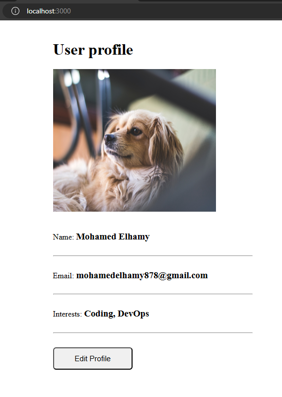
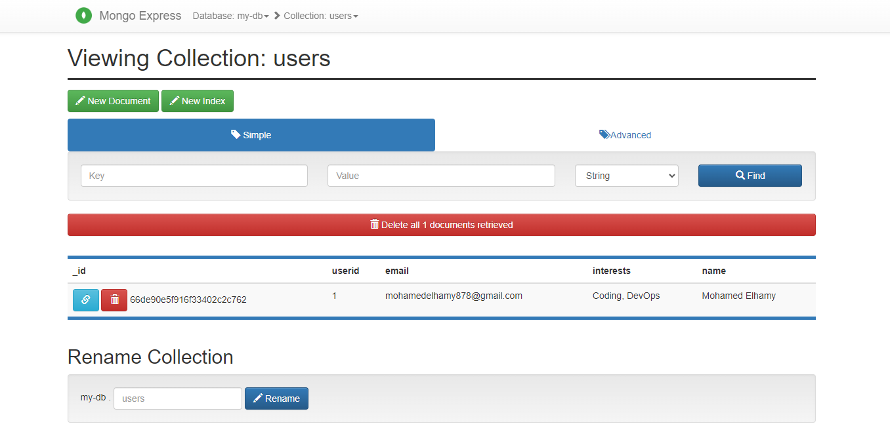
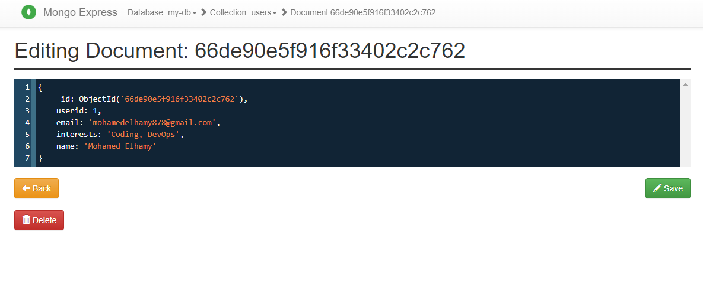
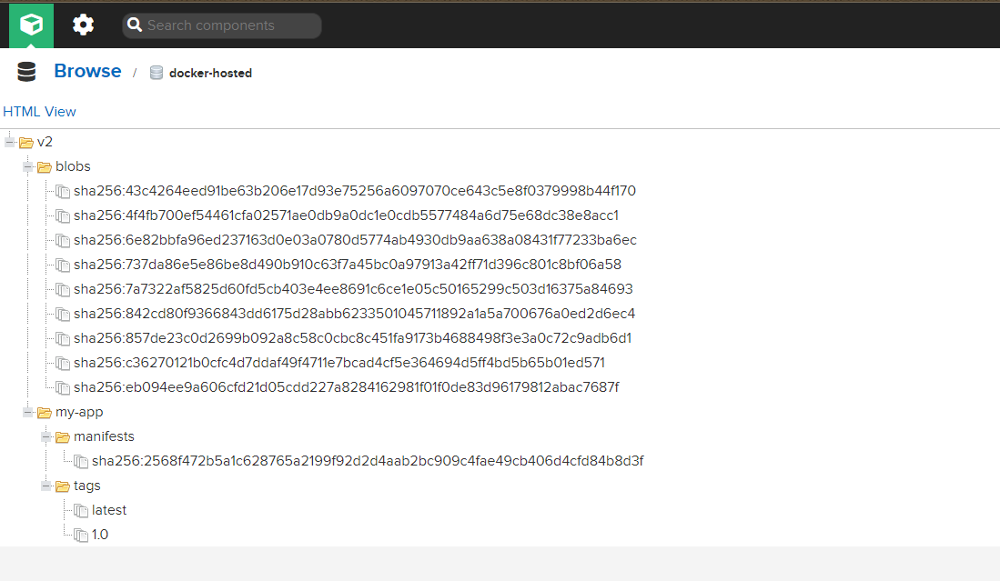
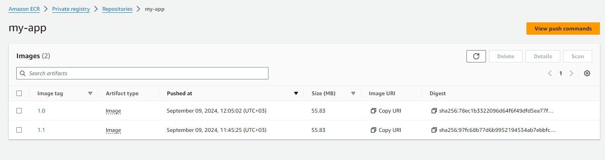

## demo app - developing with Docker

In this lesson we worked with Mongo and Docker

- I started by cloning the repo and adding him to my github account.
- I then run docker compose up to start the containers
- I then moved in to the app folder
    - ```cd app```
    - ``` npm ci ``` (npm ci is faster then npm install)
    - ``` npm run start ```
- I then went to the browser and went to localhost:3000
- I updated the information in the form and clicked submit
- 
- I then went to http://localhost:8081/ to see the data in the database
- 
- 
- I build a conatiner from the app folder
    - ```docker build -t app .```
- And pushed it to nexus by adding the nexus register to my docker engine
- 
- Also pushed it to AWS ERC by adding the AWS ERC register to my docker engine
- 
